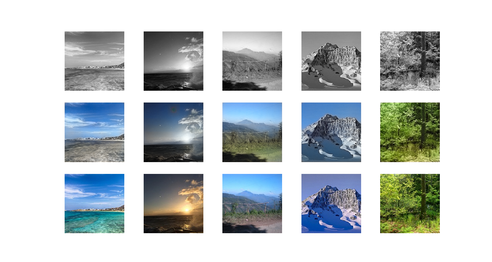
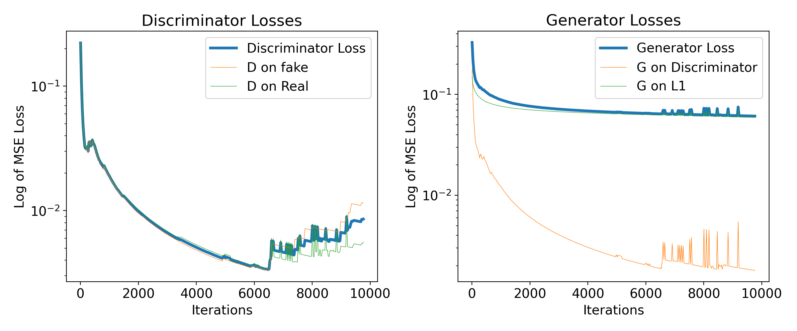

In this project, we created a colorization model that adds color to black and white images. This task is a type of generative computer vision problem that we approached with a generative adversarial network (GAN). Our learning algorithm is self-supervised because it can train on any unlabeled set of images. In place of painstaking labels, the program creates the training data by gray-scaling the images with PIL and comparing its own output to the original data. We have worked with image to image models previously, and while we have not implemented a GAN from scratch before, we have developed models with similar architectures to the generator and the discriminator networks. This colorization task is a popular problem, and developers have attempted multiple approaches with a variety of model designs. These algorithms include auto-encoders, variational auto-encoders, residual networks, convolutional U-net neural networks, generalizing the pix2pix package, and GANs similar to our own method. Among these techniques, autoencoders and GANs are the most popular architectures. While they have all found moderate success, they each struggle to correctly color images with painted objects because they don’t follow easily discernible patterns in their texture and coloration. 
We started by training our GAN model on a single data set of 7,129 landscape images published on Kaggle by a developer named Bhabuk. This dataset contains a wide variety of environments, but primarily features blue, green, and pale colors such as white snow, brown mountains, and gray buildings. See Figure 1 below for a few examples. We subsequently added more datasets including: images of faces uploaded to The University of Oxford by Qiong Cao, Li Shen, Weidi Xie, Omkar Parkhi, and Andrew Zisserman, pictures of flowers uploaded to The University of Oxford by Maria-Elena Nilsback and Andrew Zisserman, and a variety of scenes uploaded to MIT’s AI and ML page by Xavier Puig and Hang Zhao. In total, our final generator network trained on over 115,00 images. These datasets were originally intended for a variety of computer vision and classification tasks. However, we created our own labeled dataset with just the images. We simply downloaded the images without the label data, then ran a grayscaling algorithm from the Image class in the PIL python library on each of the photos while training to produce a unique training dataset.

Figure 1: In this table, the bottom row shows the original images from the dataset, the top row contains the grayscale version, and the middle row has the output of our colorization model. 

Our overall approach relies on the unique learning paradigm possible with GANs. This type of learning algorithm is well-suited for black and white to color conversion tasks, as it excels in capturing the complex data distributions and generating realistic outputs from the limited information available in black and white pictures. In our implementation, the generator updates its weights based on the sum of two loss functions. The first computes the L1 norm of the model’s output and the original image to capture the true color and vibrancy of the image. The second is the discriminator, which outputs the second loss value that improves how realistic the colorization output looks. 
The generator employs an image to image U-net architecture with 15 layers and a total of 54,409,858 trainable parameters. The contracting and expanding network topology of the U-net is ideal for image-to-image translation tasks and capturing the context and details in images. It also smooths the gradient and helps prevent information loss deep in the network. The discriminator is a convolutional LeakyReLU neural network with five layers and 2,765,633 trainable parameters. We randomly initialized these weights at the beginning of each training run and did not use any pre-trained weights. However, we implemented the lottery-ticket initialization technique discussed in class to prune 20% of the weights at specified intervals, successfully creating a much smaller but capable final model. 
Before training, we randomly shuffled the images in our dataset, then allocated the first 80% for training and the last 20% for testing. At each training step, the optimizer conducts a forward pass with a black and white photo through the generator. Then the optimizer trains the discriminator by asking it to classify the generator output and an original image as real or fake. Finally, the generator updates its weights based on the adversarial loss and the L1-norm of the real image compared to its output image. This alternating process iteratively improves both generator and discriminator in the GAN framework. 

Figure 2; Losses of the discriminator (left) and generator (right) networks. The overall loss is the combination of two factors in each network: accuracy classifying both real and fake images for the discriminator, and the MSE loss from the discriminator and the L1 norm for the generator.

Our first algorithm was very straightforward, but once we got it working, we made several additional changes. We introduced model checkpointing, implemented lottery ticket initialization with pruning, increased the size of the generator network, and attempted both a penalized tanh activation function and an AdaBelief optimizer. We made these changes to experiment with the findings that we learned about in class and help our model train better. Because of our network architecture and our iterative improvements, we were able to successfully convert black and white images to full color. We can tell the neural net did not overfit because it never became overly confident about its color predictions. When the color is ambiguous, the generator typically resorts to shades of gray and light blue. Even when it was more confident for consistent objects like the ocean or sky, the result was not quite as vibrant as the original image. In contrast, an overfit model would output more vivid but incorrect colors for the test data. 
It is worth noting that the consistent color predictions imply that the model has learned something about objects in real life and what they should look like. The first column of Figure 1 suggests that the model has learned that skies are typically blue and clouds white, but it doesn’t recognize the texture of shallow water. Column two indicates that it has figured out that the sun is white, but not that sunsets have a wider variety of colors. Even when the model isn’t able to perfectly match the original picture, however, its output often still looks right to the casual observer. Furthermore, the other columns show that it can properly identify other objects such as trees, mountains, snow, and even shadows. Future work may include pre-training an image classifier to achieve more vibrancy and more consistently realistic colorizations. 
